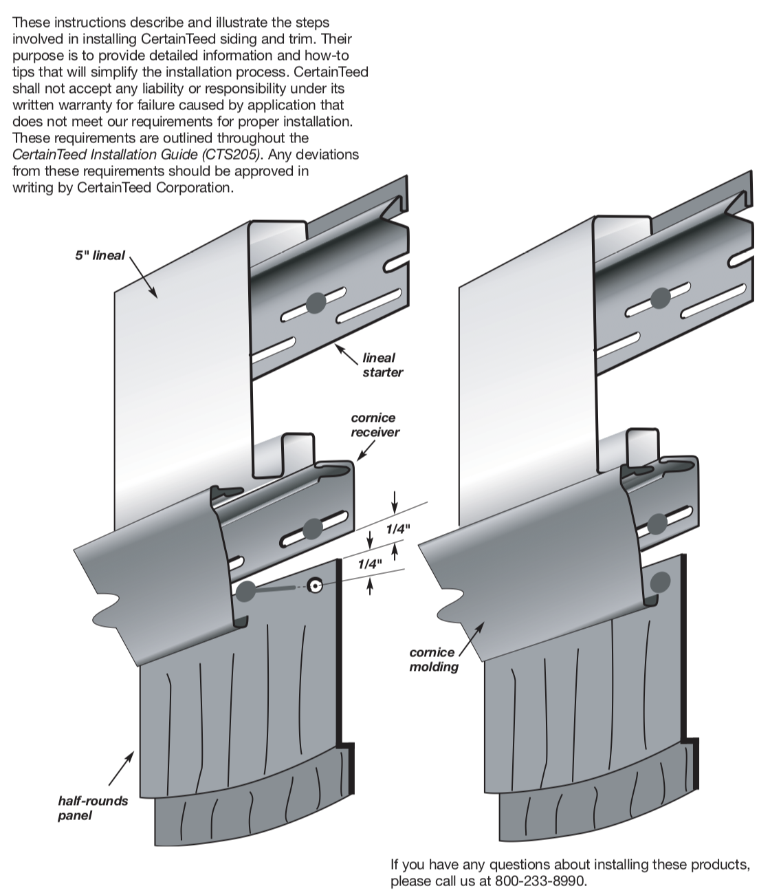
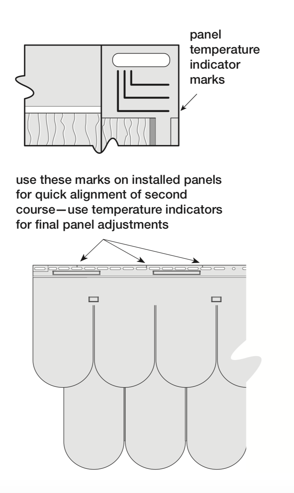

# [CertainTeed Cedar impressions shingles](https://docs.certainteed.com/v/siding-group-product-catalog?_ga=2.113610823.133233729.1573514535-1372786020.1573514535)

Product Code:  30128  Finish:  Perfection  Length:  32"  Thickness:  .100"  Exposure:  12-1/2"  Projection:  3/4"  Panels/Ctn.:  12  Squares/Ctn.:  .333  Car tons/ Pallet:  16  lbs./Ctn.:  ≤ 2

## [Installation Website](https://www.certainteed.com/siding/products/cedar-impressions-6-14-half-round-shingles/) 

[Lineal Frieze Boards](https://www.certainteed.com/resources/SPG_Cedar_Impressions_Half-Rounds_Frieze_Boards.pdf)

## CertainTeed Installation Guide [CTS205](https://www.certainteed.com/resources/SPG_Installation_Manual_CTS205.pdf)

The guide will be used to describe proposed procedures for your repair for both front and rear of home.

### Flashing 

Flashing around windows need to happen regardless of starter and channel per window manufacturer specs (pg 70). There exists CertainTeed CertaWrap for the wall itself. You may have thought that the optional crown molding treatment options (pg 59) was what the installers left off when doing the original install. However there may be more we need to appreciate here.

Page 45 details flashing I did not see -its up there and maybe we didn't catch it the second go at looking. Page 48 details J-channel around windows and how it holds the siding in place. The channels are designed to keep the water running down the channel and not into the house, cutting rain tabs on some sides and notches on others to force the lap and eventual water away from the sides of the window. 

Steve has a j-channel tool for reseating the locking mechanism on the front of the house- it may be referred to as a snake bar (pg 108). I believe there is also a blind cutting tool. I think the 45 cutting tool is the same. It has been over 10 years since I messed with vinyl siding, but I believe it is not a show stopper. Steve has plenty more experience in the field than I do. We also may need a cam clip and rivets to make a truly by-the-book install. That also could be why the siding failed- the clips could have been detached with the pressure washer and then the wind was able to get behind them and pull out from the wall.

### Proper cutting around a window is explained on page 99.

However, starting the shingles around the window top without a channel might be worth consideration for the moment. There might be a wooden shim needed to create the proper angle and some means to assure the bottom is not exposed for further issues. My thought is that the sides of the shingles around the window could have been the entry point. When we get up there closer to inspect the remaining piece we can see how they actually got the first run to seat.

### J channel installation

Wind and more importantly rain getting behind the shingles are the primary concern, that's why I wanted to be thorough with my research on the proper installation techniques. I know to make the notches we have to cut the channel 2 inches longer than the window dimensions for the bottom, making notches out for runoff. The sides get the 45 cut and rain tab, and the top folds over. I have bent flashing with a break for windows, doors, and deck bands, so I am comfortable with employing the proper procedure [here](https://www.youtube.com/watch?v=geQVbvuiNw0).

There is 2 1/2" window and door casing (larger exception) and 3 1/2" Snap-on Lineal Application around Windows and Doors as well. The Lineal Starter Application for Windows (page 50) and Door Surrounds may be closer to our solution. What I'm trying to key in on is the way to assure the bottom portions of the semi round shingles properly marry the edge at which contact happens around the window itself.

### F channel inspection (pg 83)

The soffit will meet the rake to the peak, so we need to be careful that the wind did not damage any of that and take appropriate action to assure it will not allow the soffit to be the next victim of a wind event over there. Page 118 gets into details for termination to the soffit with half round shingles. See below for round shingle specific instructions.

### Temperature induced spacing

PanelThermometerTM exists on each panel that displays panel temperature and indicator lines that serve as guides for proper spacing between the panels. This will tell how large of cuts and gaps need to happen- in below 40 it is typical 3/8 expansion consideration. There also needs to be a slot tool to puncn out slots for the termination of horizontal shingling to meet the first run of shingle. 

### Notes on steep rake for round shingles

See page 105

### Half-Round Shingles in Gable Ends

See page 115. This gives the math equation to calculate the full course height and face exposure to start dealing with a materials takeoff.

#### Install Cedar Impressions Metal Shingle Starter 

This may be a mis read if the instructions were not read properly. There may have been a metal starter that blew off somewhere? See page 97. There is not a mention of a metal starter for the round shingles- that could be a little confusing. 

### Avery Rent-all

At the Rent-all they do not rent ladder jacks for ladders and we need two with a walk board. Steve said he had a few. I don't think it is realistic to try and work this job off a single ladder. It would be too labor intensive to move the ladder around. 

A better option is to get scaffolding (optimal is coming). This will keep us from having to deal with the feet of the ladders as we traverse the gable- that eats up time and space too. Scaffold is 4 1/2 ft tall so we would need minimum of 6 sets to get us 27 feet up. 

Cost | What we get
|---|---|
? delivery fee| a big truck with the following:
$12 per week per set of scaffold | 2 end pieces, 2 cross pieces 
$24 a month per set of scaffold | same as above
$ 7.50 per week | individual walkboard  
$ 22.50 per month | individual walk board
$3 per wk | each foot
$9 per month | each foot
$275 a day | for a lift- possibly

## Lowes

No one was at building materials today- they had off. I got there at 8:10 last night and were closed. 

### Siding with Certain Teed

* Exposure dimensions: yield .333 square per box- is *their* "square" 10ftx10ftx.333 face coverage?
* There may need to be clips for installation or pins. Will solidify this prior to ordering.
* Specialty tooling we have. May need to verify slt punch mechanism and vinyl cutters.

Window wrap or appropriate flashing mechanism will be discussed prior to ordering material.

### Deck Posts

* We will look at 4 1/4 inch 8'2" posts- so comparable 4x6 PT- quantity 10. 
* SawZall Blades
* Anchoring mechanism need to be discovered if we wish to try and reuse metal ground plates. Idea is to use a countersink bit on angle and plug the holes at the base. Intent is to pierce decking to lower post for a solid connection- no strap to be used.
* Primer
* Sprayer
* Didn't discuss anyone we know with a sandblaster? Maybe just a good old hand job with a scraper. Yup, I said it. Manual labor's cousin is hose- jose:)
* bottle jacks and a jacking post (we can start by removing the one not connected to ceiling)
* 3/4 round router for posts

### Notables: 

#### Siding- best scenario

We need to come back and take a closer look at the upstairs window. Provided we stick our head out there and see no visible signs of water intrusion, and that there is a proper channel mechanism still in place to divert the water, we can proceed with the install request to use the same starting point of the existing shingles on the left side of window. However, the starter needs to be confirmed it was in fact began with the proper install. We will inspect the clips and if there were shims employed, and provided we have all the factors in place to proceed we may continue off that line. 

The main point of concern is that we are not introducing an air space for the winds to gain access behind the shingles from the bottom, and that the install procedures can be followed for securing each piece to the rake and behind the soffit. Hopefully there is solid wood around the F channel.

Optimal conditions could warrant the use of a lift for the day. The ground appeared to be level enough and have the ability to bring it around the back. We didn't perk the ground, but it may also suffice and not sink. I have some long runner boards I use to get my boat out of the swamp in my back yard. The main concern is that we can get the entire job complete in a day. I think with all the concerns above ironed out ahead of time we may be able to make that happen. It may be a half day more if there is only minor conditions to address like channels and starters. I may be 2 days if we have to replace nailer at soffit, and more if the window has wood damage.

#### Posts and deck

We should firm up the direction to take with the floor sag. We could separate the plate and band to add a shim below, bringing the deck up to level. The best time to remediate oxidation on your railing is when it is down. Sandblasting is quick. I might know a guy with a big bag of crushed walnut shells... But if we are looking at the "get-r-dun" method we all have scrapers and know how to use them. I would at least like to see all the pressure treated and grey wood exposed primed before we part ways- it would just make me feel better. 

I have a few fiends that have saw mills. I am going to reach out to them and see if there is any antifungal or otherwise treatment for exterior exposed wood application that they treat their material with. I have dealt with this before with a product called I-level, and they had a treatment program for their lumber. I wanted to mention that to you too because their production facility employs rf and lasers (I know the latter, but I think the former too) to make 24 ft boards come out perfectly straight. Every single board gets a serial number and can be tracked to the production date for QC.

Remind me about the enamel and sander and I will take care of the rusted door just cuz:) If that's the result of a clawing dog or two, we could talk about a guard like the pick guard on that guitar.

